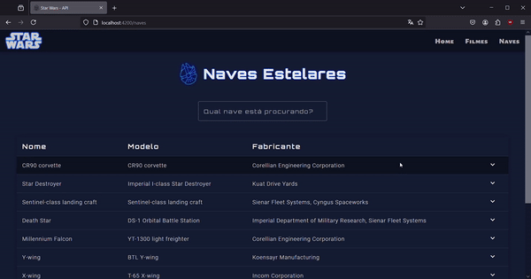

# 7 Days of Code - *Angular*

7 Dias, a cada dia um desafio a ser cumprido e ao fim um projeto pronto  🔹 [*Site do 7 Days of Code*](https://7daysofcode.io/matricula/angular-api)

**Objetivos do Projeto:** Construir uma aplicação em Angular que consuma os dados da [*API do Star Wars*](https://swapi.dev/) e por em prática o conteúdo estudado na Alura na [*Formação Angular: crie aplicações web ágeis*](https://cursos.alura.com.br/formacao-angular-crie-aplicacoes-web-ageis).


## Desenvolvimento

> **_Status:_**   
> - [x] Desafios  
> - [x] Estilização da página  

### Tecnologias
- VS Code
- Node.JS
- Angular 17.0.3
- Typescript
- Angular Material Design 17.3.10

### Dia 1

#### Objetivos do dia

- Construir o projeto base.
  - Projeto gerado com [*Angular CLI*](https://github.com/angular/angular-cli) versão 17.0.3.
- Adicionar o Material Design.
  - Instalado com o comando ```ng add @angular/material```
- Criar os componentes das páginas de *Home*, *Filmes* e *Naves*.
  - No diretório `app`, criar o subdiretório `components` e dentro dele outro subdiretório `pages` para os componentes do projeto.
  - Componentes criados com o comando ```ng g c [nome-do-componente]```
- Aplicar o esquema de rotas para redirecionar para cada um desses componentes.
  - Rotas configuradas no arquivo `app.routes.ts`.
- Criar um menu para acessar as rotas utilizando o componente *Toolbar* do Material Design.
  - Componente `Header` criado no subdiretório `shared`

### Dia 2

#### Objetivos do dia

- Trabalhar na construção de uma lista para exibir os filmes da franquia Star Wars de forma estática, sem usar a API.
- Usar o arquivo `films.json`.
- Exibir os dados utilizando o componente *Table* do Material Design.
  - No arquivo `filmes.component.ts` foi criado uma inteface `Filme` com os dados escolhidos para serem exibidos na tabela.

### Dia 3

#### Objetivos do dia

- Buscar os filmes na API, substituindo a busca no arquivo JSON por uma requisição na [*API*](*https://swapi.dev/api/*).
- Para resolver esse desafio usar a camada de `Serviço`.
- Criar uma interface para definir as propriedades da API.
- Usar tipo `genérico` `<T>`.

### Dia 4

#### Objetivos do dia

- Criar um formulário para realizar a busca pelo título do filme.
- Usar o recurso de busca da API, que filtra o conjunto de informações. Para isso, a URL recebe o parâmetro `search`.
  - Formulário criado usando o componente *Form field* do Material Design.
- Aplicar um *Spinner* para quando a API demorar a mostrar as informações e, assim, proporcionar uma melhor experiência ao usuário. 

### Dia 5

#### Objetivos do dia

- Construir uma tabela para exibir as naves estelares.
- Aplicar uma notificação de carregamento (*Spinner*) na página das naves.

### Dia 6

#### Objetivos do dia

- Criar uma propriedade `totalDeNaves` no componente `Naves` e atribuir o valor da propriedade `count` presente na resposta da requisição.
- Verificar o valor dessa propriedade e o valor de quantas naves aparecem em tela.
- Realizar uma alteração na requisição para adicionar um parâmetro `page`, com o número da página desejada.
- A requisição deve receber a página de forma dinâmica, ou seja, por meio de um evento no template. Para isso, utilizar o *Paginator* do Material Design.  

### Dia 7

#### Objetivo do dia

- Selecionar algumas informações sobre cada nave para exibir na linha da tabela.   
- Adicionar um evento de clique na linha da tabela para que exiba mais dados sobre a nave selecionada.  
- Pode utilizar a [tabela com a linha expansível](https://material.angular.io/components/table/examples#table-expandable-rows), um exemplo de tabela que abre uma linha logo abaixo do item selecionado.  
  
<br/>

--------------------------
### Estilização

- No componente `Home` a ideia foi que a estilização lembrasse os filmes, para o background foi usada uma imagem do espaço sideral e para os links de acesso foi usado a imagem do nome da franquia e a imagem da *Estrela da Morte*.
  - Ao passar o mouse sobre os links (*hover*) foi adicionado efeito para lembrar um holograma.
  - Foi usada a paleta de cores presente na Home para estilizar as páginas de `Filmes` e `Naves`.
    - No arquivo gerado pelo *Material Design*, a paleta de cores primária foi alterada para `blue` e a paleta *accent* para `light-blue` para combinarem com as demais cores escolhidas.

- **Ícones utilizados na estilização**  
[*Millenium falcon icons created by William Richon - Flaticon*](https://www.flaticon.com/free-icons/millenium-falcon)  
[*Lightsaber icons created by Nhor Phai - Flaticon*](https://www.flaticon.com/free-icons/lightsaber)  
[*Darth vader icons created by William Richon - Flaticon*](https://www.flaticon.com/free-icons/darth-vader)

<br/>

--------------------------

### Refatoração

- Para melhorar a performance ao carregar a imagem de background na `Home` foi usada a diretiva `NgOptimizedImage` e os atributos `fill` e `priority` na tag `img`.
- Foi criado o componente `Titulo` para ser usado nos componentes `Filmes` e `Naves` e diminuir a repetição de código com auxílio do *binding de propriedade*. 
- No componente `Filmes` foram criadas duas funções para formatar a exibição de determinadas informações:
  - A função para formatar a `data de estreia` dos filmes para o padrão `pt-BR` com auxílio do método `toLocaleDateString()`.
  - A função para editar os dados das propriedades `espécies`, `planetas` e `veículos`, deixando a visualização menos poluída. Foi excluído o início do endereço de acesso que é o mesmo para todos, ficando apenas o nome da propriedade e o id. Para isso, foi utilizado os métodos `lastIndexOf()` e `slice()`
    - Essas propriedades trazem como informação uma array de endereços HTTP, por isso, cada endereço foi adicionado dentro de uma tag âncora para facilitar o acesso ao conteúdo.
- No componente `Naves` foi criada uma função para alterar o título de cada coluna, para alterar os nomes das propriedades em inglês e exibi-las em português.  

<br/>

--------------------------
  

